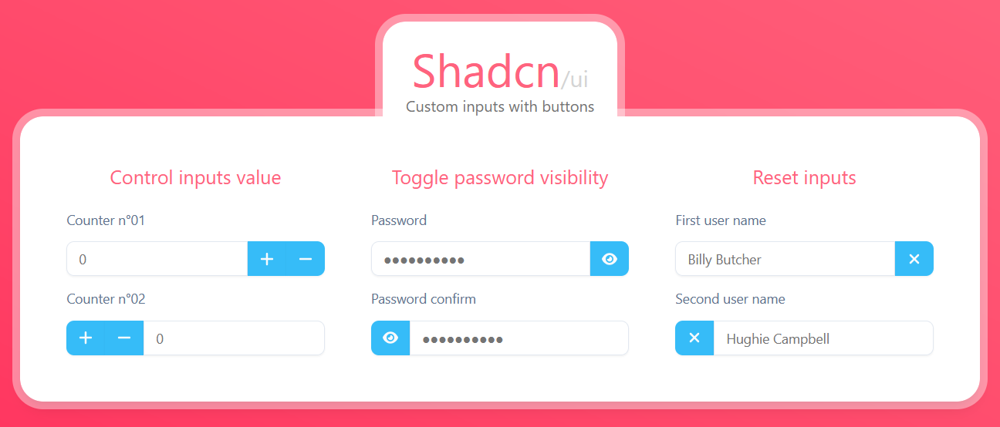

# Shadcn/ui input with buttons



A React project to create a custom input component with buttons on either side

## Stack

- [Vite](https://vitejs.dev/)
- [React](https://reactjs.org/)
- [TypeScript](https://www.typescriptlang.org/)
- [TailwindCSS](https://tailwindcss.com/)
- [Shadcn/ui](https://ui.shadcn.com/)
- [React Icons](https://react-icons.github.io/react-icons/)

## Usage

Clone the repo and run the following commands:

Install dependencies:

```bash
yarn install
```

Run the app in development mode:

```bash
# Development mode
yarn dev
```

Run the app in production mode:

```bash
# Production mode
yarn build && yarn start
```
